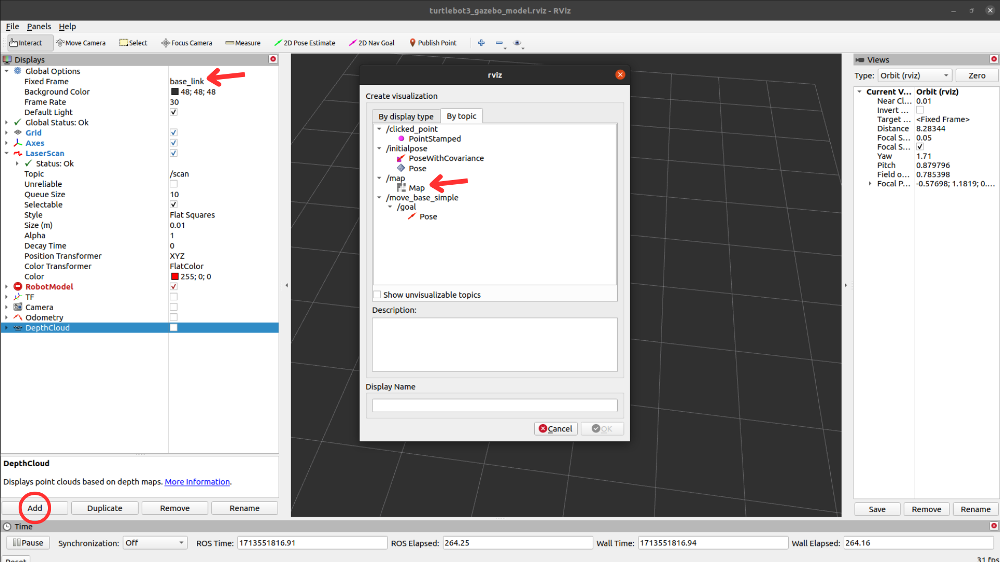

# turtlebot_mcl

**A Monte Carlo Localization (MCL) algorithm developed by students for the Autonomous Systems (SAut) subject lectured at Instituto Superior Técnico (IST).**

## Menu

  - [**Prerequisites**](#prerequisites)
  - [**Install**](#install)
  - [**Source Code**](#source-code)
  - [**Datasets**](#datasets)
  - [**Important Tools**](#important-tools)
    - [**Setting up the Gazebo Environment**](#setting-up-the-gazebo-environment)
    - [**Gmapping**](#gmapping)
    - [**AMCL**](#amcl)

## Prerequisites
- [Ubuntu](https://ubuntu.com/download) (tested with 18.04 and 20.04)
- [ROS](http://wiki.ros.org/ROS/Installation) (tested with Melodic and Noetic)

## Install
Use the following commands to download and compile the package. Change `catkin_ws` depending on your setup.

```
$ cd ~/catkin_ws/src
$ git clone https://github.com/Moraisgit/turtlebot_mcl_localization.git
$ cd ..
$ catkin_make
```

## Source Code
The functionalities of each script are below described.
- `busca_V5.0.py` - Implements the algorithm for real data (and for Gazebo)

- `graphs1_V5.0.py` - Implements a graph (to be ran with `busca_V5.0.py`) for the robot's position and the particles

- `graphs2_V5.0.py` - Implements a graph (to be ran with `busca_V5.0.py`) showing the robot's path estimated by our code (weighted average with 1% of the heaviest particles) along with the path followed by AMCL. It also displays the RMSE in another graph

- `Microsimulador_MCL_V5.0.py` - Implements the algorithm for synthetic data

- `MSgraphs1_V5.0.py` - Implements a graph (to be run with `Microsimulador_MCL_V5.0.py`) for the robot's position and the particles

- `MSgraphs2_V5.0.py` - Implements a graph (to be run with `Microsimulador_MCL_V5.0.py`) showing the robot's path estimated by our code (weighted average with 1% of the heaviest particles) along with the actual path taken by the robot (known <i>a priori</i>, not using [AMCL](https://wiki.ros.org/amcl)). It also displays the RMSE in another graph

## Datasets
Several datasets were recorded and are available [here](https://drive.google.com/drive/folders/13gN8WpE1l5GEju-yHzZDzt4QcmkR-ijJ?usp=sharing).

## Important Tools

### Setting up the Gazebo Environment

- **Install Dependant ROS Packages**

What is explained next is more detailed documented [here](https://emanual.robotis.com/docs/en/platform/turtlebot3/simulation/).

For ROS Melodic:
```
$ sudo apt-get install ros-melodic-joy ros-melodic-teleop-twist-joy \
  ros-melodic-teleop-twist-keyboard ros-melodic-laser-proc \
  ros-melodic-rgbd-launch ros-melodic-depthimage-to-laserscan \
  ros-melodic-rosserial-arduino ros-melodic-rosserial-python \
  ros-melodic-rosserial-server ros-melodic-rosserial-client \
  ros-melodic-rosserial-msgs ros-melodic-amcl ros-melodic-map-server \
  ros-melodic-move-base ros-melodic-urdf ros-melodic-xacro \
  ros-melodic-compressed-image-transport ros-melodic-rqt* \
  ros-melodic-gmapping ros-melodic-navigation ros-melodic-interactive-markers

# Install TurtleBot3 via Debian Packages.
$ sudo apt-get install ros-melodic-dynamixel-sdk
$ sudo apt-get install ros-melodic-turtlebot3-msgs
$ sudo apt-get install ros-melodic-turtlebot3
```
For ROS Noetic:
```
$ sudo apt-get install ros-noetic-joy ros-noetic-teleop-twist-joy \
  ros-noetic-teleop-twist-keyboard ros-noetic-laser-proc \
  ros-noetic-rgbd-launch ros-noetic-rosserial-arduino \
  ros-noetic-rosserial-python ros-noetic-rosserial-client \
  ros-noetic-rosserial-msgs ros-noetic-amcl ros-noetic-map-server \
  ros-noetic-move-base ros-noetic-urdf ros-noetic-xacro \
  ros-noetic-compressed-image-transport ros-noetic-rqt* ros-noetic-rviz \
  ros-noetic-gmapping ros-noetic-navigation ros-noetic-interactive-markers

# Install TurtleBot3 via Debian Packages.
$ sudo apt install ros-noetic-dynamixel-sdk
$ sudo apt install ros-noetic-turtlebot3-msgs
$ sudo apt install ros-noetic-turtlebot3
```

- **How to use**

Use the following commands to download and compile the package of turtlebot Gazebo environments. Change `catkin_ws` depending on your setup. Change `<distro>` depending on your ROS distribution.
```
$ cd ~/catkin_ws/src
$ git clone -b <distro>-devel https://github.com/ROBOTIS-GIT/turtlebot3_simulations.git
$ cd ..
$ catkin_make
```

Before launching anything, make sure to have a `roscore` running.

To launch Gazebo worls use the following commands. Change `catkin_ws` depending on your setup. Change `<launch_file_name>` depending on the world you intend to launch.
```
$ cd ~/catkin_ws
$ source devel/setup.bash
$ roslaunch turtlebot3_gazebo <launch_file_name>.launch
```

To teleoperate the turtlebot use the following commands. Change `catkin_ws` depending on your setup.
```
$ cd ~/catkin_ws
$ source devel/setup.bash
$ roslaunch turtlebot3_teleop turtlebot3_teleop_key.launch
```

To launch the Rviz configuration use the following commands. Change `catkin_ws` depending on your setup.
```
$ cd ~/catkin_ws
$ source devel/setup.bash
$ roslaunch turtlebot3_gazebo turtlebot3_gazebo_rviz.launch
```

### Gmapping
Information about the package is more detailed documented [here](http://wiki.ros.org/gmapping).

- **Install**

Use the following commands to download and compile the package. Change `catkin_ws` depending on your setup.
```
$ cd ~/catkin_ws
$ git clone https://github.com/ros-perception/slam_gmapping.git
$ cd ..
$ catkin_make
```
- **How to use**

It is considered that the Gazebo environments mentioned earlier are set up.

Before launching anything, make sure to have a `roscore` running.

Launch the Rviz configuration as mentioned earlier and run the gmapping node with the topic of the LiDAR scans as an argument.
```
$ cd
$ rosrun gmapping slam_gmapping scan:=/scan
```

To visualize the map on Rviz, click on "Add"->"By topic"->"Map"->"OK" and then "Global Options"->"Fixed Frame"->"map". An image follows in order to help the change process.



Then save the Rviz configuration with "File"->"Save Config As" and overwrite the file `turtlebot3_gazebo_model.rviz`.

To start seeing a map being built, play a dataset with the following command. Change `datasets` and `<rosbag_file_name>` according to where you have the datasets stored and the name of the file you intend to play. The flag `-r 3` will increase the speed that the rosbag is played.
```
$ cd ~/datasets
$ rosbag play <rosbag_file_name>.bag -r 3
```

### AMCL

For groundtruth one can use the [AMCL](https://wiki.ros.org/amcl) ROS package.

To have the needed dependencies please follow what is documented at [**Setting up the Gazebo Environment**](#setting-up-the-gazebo-environment). If you have done so, please check that you have the following directory on your local machine `/opt/ros/<ros_distro>/share/turtlebot3_navigation`. Inside it you should have a directory `launch` with three launch files and we will be using the `turtlebot3_navigation.launch` file.

Before launching anything, make sure to have a `roscore` running.

Use the following commands to run AMCL. Change `/path/to/map.yaml` depending on your setup.
```
$ cd
$ roslaunch turtlebot3_navigation turtlebot3_navigation.launch map_file:=/path/to/map.yaml
```

To start seeing particles in Rviz play a dataset with the following command. Change `datasets` and `<rosbag_file_name>` according to where you have the datasets stored and the name of the file you intend to play. The flag `-r 0.05` will decrease the speed that the rosbag is played so one can give a good pose estimate.
```
$ cd ~/datasets
$ rosbag play <rosbag_file_name>.bag -r 0.05
```

After ensuring a good initial pose estimate one can increase the velocity at which your bag file is played. See the attached video for visual help on how to do it.


